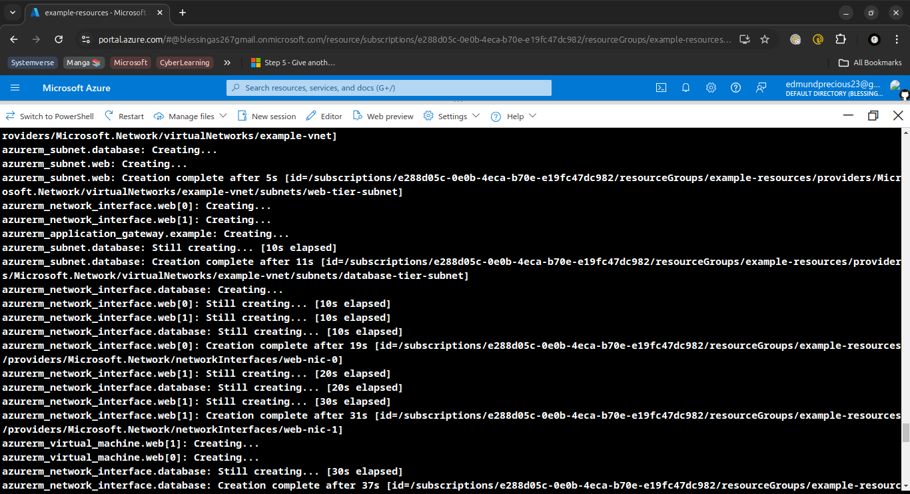
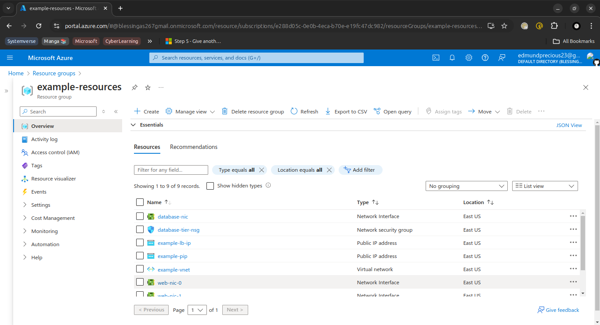

# Azure Infrastructure Provisioning with Terraform

## Overview

This Terraform project provisions a comprehensive Azure infrastructure including:

- **Resource Group**
- **Virtual Network (VNet)**
- **Subnets (Web Tier & Database Tier)**
- **Network Security Groups (NSGs)**
- **Network Interfaces**
- **Virtual Machines (VMs) for Web and Database Tiers**
- **Load Balancer**
- **Application Gateway**
- **Azure SQL Server and Database**

This setup ensures a scalable, secure, and highly available environment for deploying applications.

## Project Structure

1. **`main.tf`** - Defines core Azure resources such as VNet, Subnets, NSGs, VMs, Load Balancer, Application Gateway, and SQL resources.
2. **`network.tf`** - Manages the network configuration including VNet, Subnets, and Network Security Groups.
3. **`vm.tf`** - Configures Virtual Machines and their Network Interfaces.
4. **`loadbalancer.tf`** - Sets up the Azure Load Balancer.
5. **`appgateway.tf`** - Configures the Azure Application Gateway.
6. **`sqlserver.tf`** - Defines the Azure SQL Server.
7. **`sqldatabase.tf`** - Configures the Azure SQL Database.
8. **`keyvault.tf`**: - Configuration of Azure Key Vault and storage of SQL Server credentials.

## Prerequisites

- **Terraform**: Ensure Terraform is installed. [Download Terraform](https://www.terraform.io/downloads).
- **Azure Account**: An Azure subscription is required. [Create an Azure account](https://azure.microsoft.com/en-us/free/).
- **Azure CLI**: Install Azure CLI and authenticate. [Install Azure CLI](https://docs.microsoft.com/en-us/cli/azure/install-azure-cli).

## Configuration

### Variables

Ensure to define necessary variables in a `terraform.tfvars` file or directly in your Terraform configuration. Examples include:

### Provider Configuration

The provider configuration is included in `main.tf`. Ensure the Azure provider is set up correctly.

## Resources Defined

### Resource Group

Defines the Azure resource group in which all resources will be created.

### Network Configuration

- **Virtual Network**: Provides a secure, isolated network.
- **Subnets**: Separates the network into web and database tiers.
- **Network Security Groups**: Defines rules to control traffic flow.

### Virtual Machines

Configures VMs for both web and database tiers, ensuring availability and scaling.

### Load Balancer

Distributes traffic across VMs for high availability.

### Application Gateway

Provides advanced routing and load balancing.

### SQL Server and Database

Sets up Azure SQL Server and Database for backend data storage.

### Keyvault.tf
   Key security aspects are handled using Azure Key Vault to manage sensitive credentials.

## Deployment

1. **Initialize Terraform**: Run `terraform init` to initialize the working directory.
2. **Plan Deployment**: Run `terraform plan` to preview the changes Terraform will make.
3. **Apply Configuration**: Run `terraform apply` to apply the configuration and provision resources.
4. **Destroy Resources**: If needed, run `terraform destroy` to remove all resources created by this configuration.

  

## Troubleshooting

- **Resource Not Found**: Ensure all resources are declared and correctly referenced.
- **Authentication Issues**: Verify Azure CLI is authenticated and has the necessary permissions.
- **Invalid Configuration**: Check for syntax errors or missing parameters in your `.tf` files.
  
## Results:

  

## References

- [Terraform Documentation](https://www.terraform.io/docs)
- [Azure Resource Manager Documentation](https://docs.microsoft.com/en-us/azure/azure-resource-manager/management/overview)
- [Azure CLI Documentation](https://docs.microsoft.com/en-us/cli/azure/)
- [Azure Virtual Network Documentation](https://docs.microsoft.com/en-us/azure/virtual-network/)
- [Azure Virtual Machines Documentation](https://docs.microsoft.com/en-us/azure/virtual-machines/)
- [Azure Load Balancer Documentation](https://docs.microsoft.com/en-us/azure/load-balancer/)
- [Azure Application Gateway Documentation](https://docs.microsoft.com/en-us/azure/application-gateway/)
- [Azure SQL Database Documentation](https://docs.microsoft.com/en-us/azure/sql-database/)
- [Terraform Keyvautlt Documentation](https://registry.terraform.io/providers/hashicorp/azurerm/latest/docs/resources/key_vault)

--

